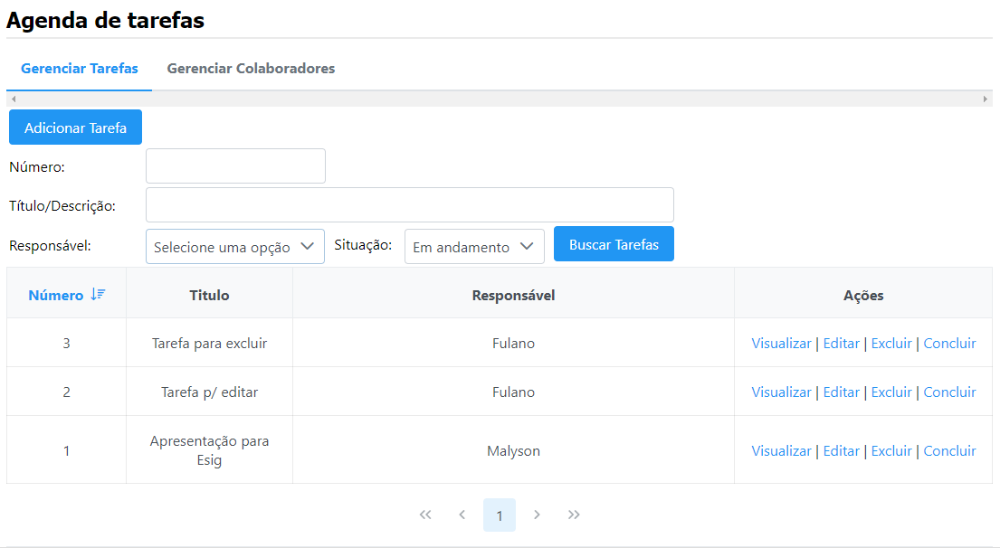
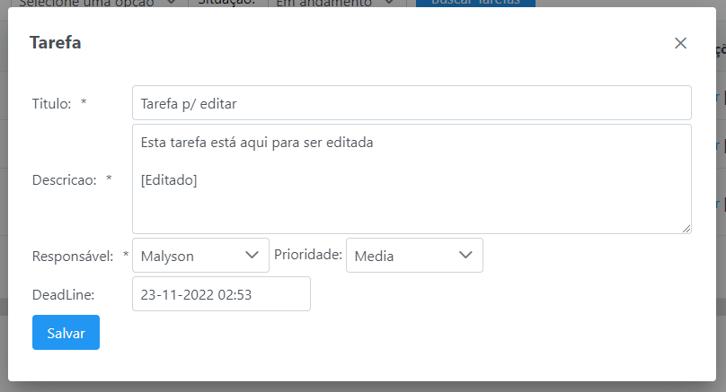
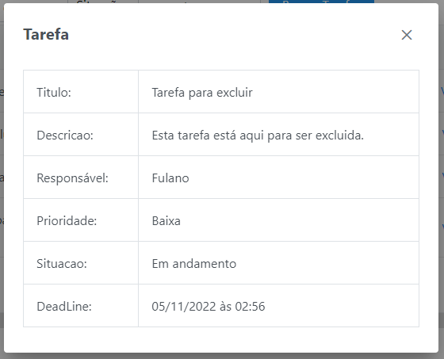
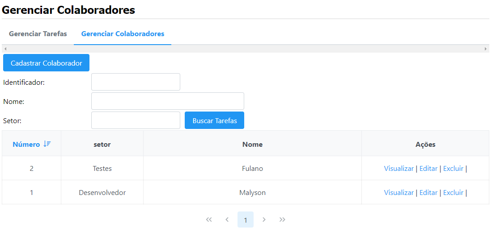
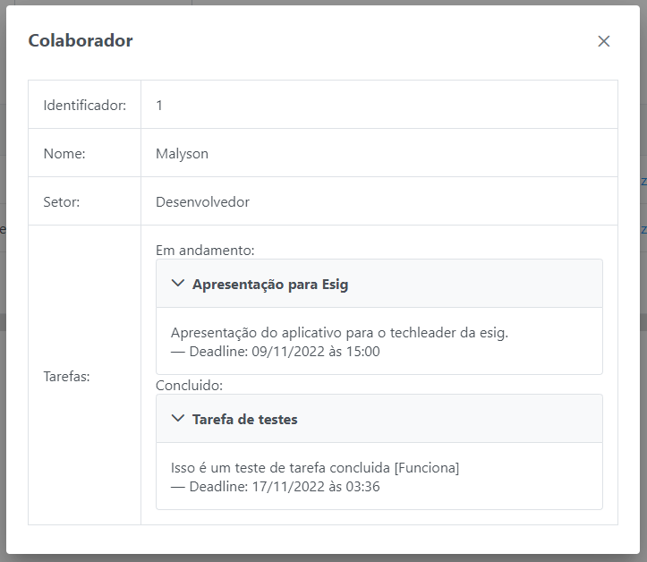
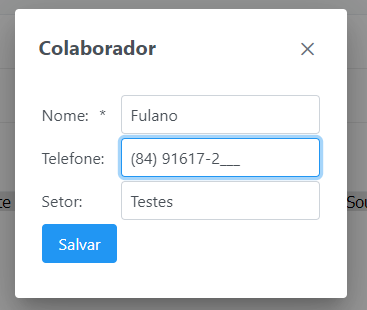

# Sistema de gestão de tarefas

## [Teste o sistema aqui (Heroku)](https://sistema-tarefas-esig.herokuapp.com/)

### <b> Ferramentas utilizadas: </b>

- Eclipse IDE for Enterprise Java and Web Developers 2022-09 (4.25.0)

- PostgreSQL 14

- Java 8

- Maven 3.8.6 (wrappler disponível na raiz do diretório)

- JSF

- JPA (Implementação: Hibernate)

- Heroku - pode ser acessado por aqui: [Clique aqui](https://sistema-tarefas-esig.herokuapp.com/)

- Tomcat 9.0 Server

- jUnit 5

- PrimeFaces 12

### <b> Instruções de execução: </b>

- Criar um Schema chamado <b>tarefas</b> no PostgreSQL
  OBS: login e senha do banco de dados podem ser alterados em persistence.xml

- Recomendado abrir o projeto com o Eclipse.

- Na aba Servers instalar o tomcat (9.0 de preferência)

- Sincronizar o projeto com o tomcat.

- Realizar o maven update project no eclipse (alt + F5).

- No eclipse executar (run as) maven install.

- Iniciar o tomcat.

O projeto agora deve estar rodando em seu localhost:8080/tarefas/
  OBS: Os responsáveis são cadastrados na outra aba.

### <b> Oque foi feito:  

[X] a) Aplicação Web utilizando JSF

[X] b) Persistencia em banco de dados Postgres

[X] c) JPA utilizado

[X] d) Testes de unidades com jUnit 5

[X] e) Projeto publicado no Heroku

f) Outros:

[X] Criar uma tarefa

[X] Atualizar uma tarefa

[X] Remover uma tarefa

[X] Listar tarefas

[X] Concluir tarefa

[X] Pagina de pesquisa de Tarefas e Responsáveis

[X] Validação de formulários

[X] Adicionar e remover Responsáveis

[X] Listar Responsáveis

[X] UI do JSF com PrimeFaces

Listagem e busca de tarefas

Edição ou adição de tarefas

Visualizar tarefa

Listagem e busca de colaboradores

Visualização de um colaborador

Edição ou adição de colaborador
